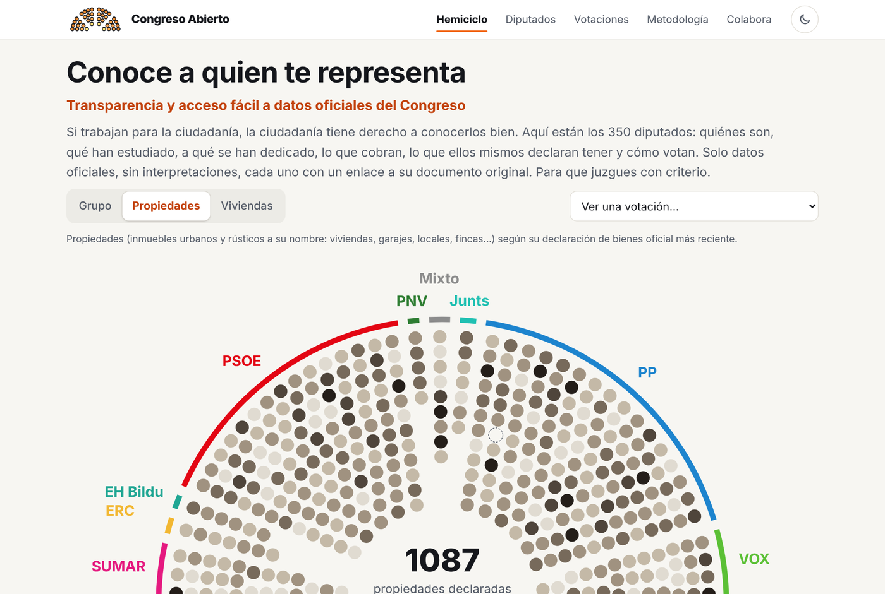

<p align="center">
  <a href="https://congresoabierto.pages.dev"></a>
</p>

<h1 align="center">Congreso Abierto</h1>

<p align="center">
  <strong>Conoce a quien te representa</strong><br>
  Transparencia y acceso fácil a datos oficiales del Congreso
</p>

<p align="center">
  <a href="https://congresoabierto.pages.dev"><strong>congresoabierto.pages.dev</strong></a> ·
  <a href="https://congresoabierto.pages.dev/colabora">Colabora</a> ·
  <a href="#hoja-de-ruta">Hoja de ruta</a>
</p>

<p align="center">
  <a href="https://github.com/MarcoAnarmo/CongresoAbierto/actions/workflows/ci.yml"></a>
  <a href="LICENSE"></a>
</p>

<picture>
  <source media="(prefers-color-scheme: dark)" srcset="docs/img/portada-oscuro.png">
  
</picture>

Si trabajan para la ciudadanía, la ciudadanía tiene derecho a conocerlos bien. Congreso Abierto es una web estática, ligera y de código abierto con los datos **públicos** de los 350 diputados del Congreso: quiénes son, qué han estudiado, a qué se han dedicado, lo que cobran, lo que ellos mismos declaran tener y cómo votan.

## Qué hay en la web

- **Hemiciclo interactivo**: los 350 escaños por grupo, por propiedades o por viviendas declaradas, y el voto de cada diputado en cualquier votación del Pleno, elegida por tema.
- **Diputados**: una ficha de cada diputado con
  - un resumen de un vistazo: propiedades, viviendas, vehículos y retribución mensual;
  - su formación (y si la universidad es pública o privada según el registro oficial de universidades, el RUCT), trayectoria y cargos;
  - las deudas y préstamos que declara;
  - una línea de tiempo con sus legislaturas, cargos y declaraciones.

  Con buscador, filtros por grupo, provincia y formación, tabla de patrimonio, propiedades por grupo parlamentario y un mapa por provincia (pulsa la tuya o escribe tu código postal).
- **Votaciones**: todas las votaciones del Pleno por temas (vivienda, economía, sanidad…) con calendario, y votaciones clave con el contenido literal del texto y sus documentos oficiales.
- **Retribuciones** según los importes oficiales del régimen económico de la Cámara (2026).
- Modo claro y oscuro, y diseño pensado para el móvil.

**Principio:** solo información oficial del Estado (Congreso de los Diputados, BOE y Boletín Oficial de las Cortes Generales), sin interpretaciones ni opiniones. Cada dato enlaza a su documento original para que cada persona juzgue por sí misma.

> Las 429 declaraciones de bienes (PDF escaneados) se han copiado literalmente y revisado dos veces contra el original, incluidas sus deudas y préstamos. Las lecturas que no se han podido confirmar al 100 % se marcan en la web como «Lectura no confirmada» para que cualquiera pueda revisarlas. Ver [docs/metodologia.md](docs/metodologia.md).

## Colabora

El proyecto es público y cualquiera puede ayudar, sepa o no programar. Todos los cambios llegan mediante *pull request* y se revisan antes de publicarse.

- [Avisar de un error en un dato](https://github.com/MarcoAnarmo/CongresoAbierto/issues/new?template=error-en-un-dato.yml)
- [Hacer una sugerencia](https://github.com/MarcoAnarmo/CongresoAbierto/issues/new?template=sugerencia.yml)
- [Tareas para empezar](https://github.com/MarcoAnarmo/CongresoAbierto/issues?q=is%3Aissue+is%3Aopen+label%3A%22good+first+issue%22)
- [Hoja de ruta](https://github.com/MarcoAnarmo/CongresoAbierto/issues?q=is%3Aissue+label%3Ahoja-de-ruta)
- [Guía para colaborar](CONTRIBUTING.md) · [Código de conducta](CODE_OF_CONDUCT.md)

Lo más útil ahora mismo: **revisar fichas** contra su PDF oficial, sobre todo las marcadas como «Lectura no confirmada».

## Hoja de ruta

La intención es mantener la web **actualizada mes a mes** con los datos oficiales y seguir ampliándola. Cada paso es una [issue con la etiqueta `hoja-de-ruta`](https://github.com/MarcoAnarmo/CongresoAbierto/issues?q=is%3Aissue+label%3Ahoja-de-ruta), donde se puede comentar o colaborar:

- **Actualización mensual** de diputados, declaraciones y votaciones.
- **Gobiernos autonómicos** y, después, sus parlamentos.
- **Lenguas cooficiales**: la web en català, galego, euskara, valencià y aranés.
- **Más datos de cada diputado**: acciones y sociedades, trabajos anteriores con su empleador, y saldos y rentas declarados.
- **Datos abiertos**: descargas en JSON y CSV para que cualquiera pueda reutilizarlos.

## Puesta en marcha

Requisitos: Node 22.12 o superior.

```bash
npm install
npm run data:build   # genera data/congreso/*.json a partir de data/raw y data/manual
npm run dev          # http://localhost:4321
npm run build        # web estática en dist/
```

## Estructura

```
data/
  raw/                         datos en bruto descargados del Congreso
    diputados_base.tsv           lista oficial de diputados
    fichas.tsv                   cargos y declaración de bienes de cada ficha
    fichas-personales.jsonl      ficha personal: nacimiento, legislaturas, formación y trayectoria (literal)
    previas.tsv                  declaraciones anteriores de cada diputado
    patrimonio/revisado.jsonl    transcripción literal y revisada de cada declaración de bienes
    deudas/revisado.jsonl        deudas y préstamos de cada declaración (avisos.json: lecturas no confirmadas)
    pdf/                         PDFs oficiales descargados (no se suben al repositorio)
    votaciones/                  votaciones del Pleno y votaciones clave
  manual/                      datos editados a mano: grupos, temas, universidades (RUCT), votaciones clave, correcciones
  congreso/                    JSON finales que lee la web (generados, no editar)
scripts/
  build-data.ts                une todo y genera data/congreso/*.json
  importar-votaciones.ts       importa las votaciones del Pleno y les asigna temas
  perfil.ts                    formación, trayectoria y línea de tiempo de cada diputado
  patrimonio.ts                reglas para contar propiedades y viviendas
  deudas.ts                    deudas y préstamos declarados
  retribuciones.ts             tablas oficiales y cálculo de retribuciones
  browser/                     utilidades para ejecutar en la consola de congreso.es
src/                           web (Astro + TypeScript)
public/                        logo, iconos y cabeceras HTTP (_headers)
docs/                          metodología técnica e imágenes del README
.github/                       plantillas de issues y pull requests, y comprobación automática (CI)
```

## Actualizar los datos

congreso.es bloquea muchas descargas automáticas, así que la descarga se hace **desde el navegador**:

1. Abre https://www.congreso.es/es/opendata/votaciones y la consola (F12).
2. Pega `scripts/browser/descargar-datos.js`: descarga `diputados_base.tsv`, `fichas.tsv` y `previas.tsv`. Cópialos a `data/raw/`.
3. Para añadir **todas las votaciones del Pleno** de un día: pega `scripts/browser/votaciones-pleno.js`, elige el día en el calendario de la página y ejecuta `await window._bajarVotaciones()`. Copia los `votaciones-AAAAMMDD.jsonl` a `data/raw/votaciones/descargas/` y ejecuta `npm run data:votaciones && npm run data:build`. Los temas se asignan con `data/manual/temas.json` (correcciones puntuales en `data/manual/temas-correcciones.json`).
4. Para añadir una votación **clave** (con documentos y contenido revisados): en la misma consola, `await window._votacion('mi-id', 'SesionNNN/AAAAMMDD/VotacionNNN/VOT_xxxxxxxx')` y pega la línea en `data/raw/votaciones/votaciones-compactas.txt`. Añade en `data/manual/votaciones-clave.json` el texto oficial del expediente, su tipo, sus documentos oficiales (BOE, BOCG, Diario de Sesiones, PDF de la votación) y su contenido: títulos de artículos o extractos literales del texto oficial, sin resúmenes propios.
5. Para transcribir una declaración de bienes nueva, pega `scripts/browser/visor-declaraciones.js` y usa `await window._compose(cod, urlPdf)`, que muestra la tabla de inmuebles y la de vehículos en una sola imagen. Sigue `data/raw/patrimonio/INSTRUCCIONES.md`.
6. Para las **fichas personales** (formación, trayectoria y legislaturas): abre https://www.congreso.es/es/busqueda-de-diputados, pega `scripts/browser/fichas-personales.js` y copia `fichas-personales.jsonl` a `data/raw/`.
7. Para las **deudas** de una declaración nueva, sigue `data/raw/deudas/INSTRUCCIONES.md`.
8. `npm run data:build && npm run build`.

## Despliegue

La web se publica en **Cloudflare Pages**, conectada a este repositorio: https://congresoabierto.pages.dev

- Cada *merge* en `main` publica la web en producción.
- Cada *pull request* desde una rama de este repositorio genera una vista previa con su propia URL. Los que llegan desde un *fork* no la tienen, pero GitHub Actions comprueba que la web compila en todos.
- Configuración: comando `npm run build`, carpeta `dist`, Node 22 (`.node-version`). Las cabeceras de caché y seguridad están en `public/_headers`.

Es una web 100 % estática, así que también funciona en cualquier otro hosting estático con el mismo comando y carpeta.

## Contacto

congresoabierto.help@gmail.com. Para errores en los datos o sugerencias, mejor abre una *issue* para que quede pública.

## Licencia

Código bajo licencia MIT. Los datos y las fotografías proceden de fuentes públicas oficiales (Congreso de los Diputados, BOE y BOCG); las fotos se cargan directamente desde congreso.es.
